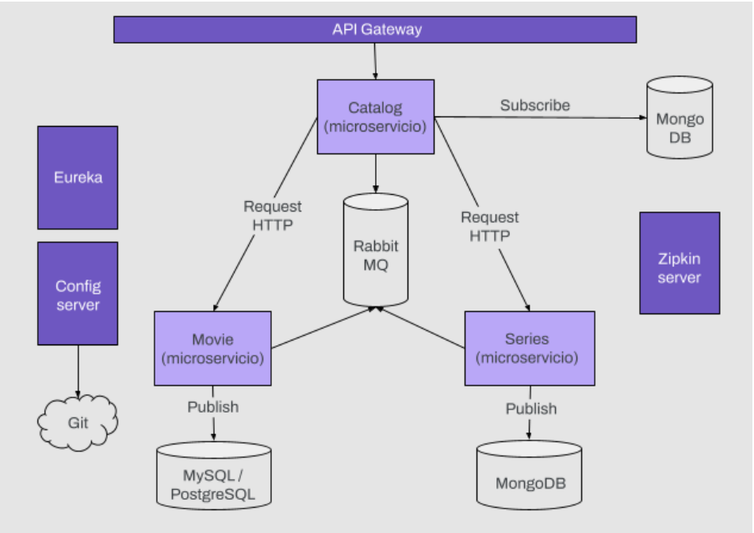
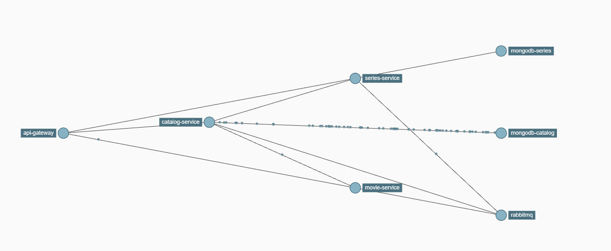
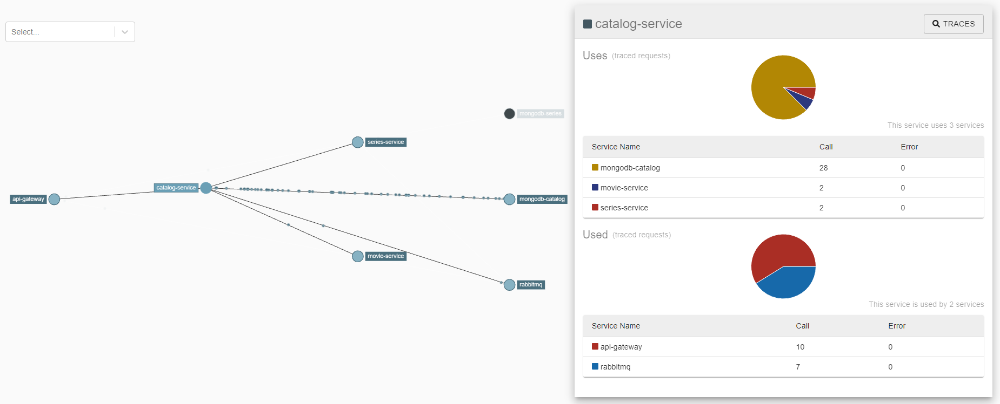
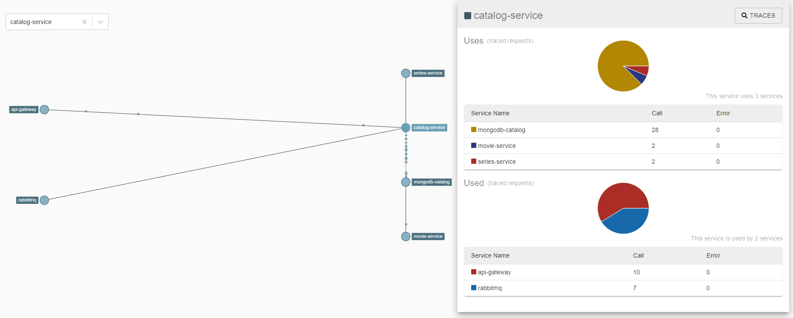

# Examen final
## Contextualización

El proyecto consiste de tres microservicios: Movie, Series y Catalog. Catalog es un
microservicio que lee información de Movie y Series con el objetivo de enviar un catálogo
al cliente. Catalog recibe un mensaje cada vez que una película o una serie es dada de alta
y las persiste en una base de datos no relacional de MongoDB. Cuando le llega una petición
del cliente, busca en la base de datos y responde.
Veamos un diagrama base de los microservicios:

## movie-service
El microservicio gestiona las operaciones sobre las películas. Cada película tiene como
atributo:

    ■ id
    ■ name
    ■ genre
    ■ urlStream

## serie-service
El microservicio gestiona las operaciones sobre las series. Cada serie tiene como atributos:

    ■ id
    ■ name
    ■ genre
    ■ seasons
        ○ id
        ○ seasonNumber
        ○ chapters
            ● id
            ● name
            ● number
            ● urlStream

## catalog-service
El microservicio tiene como objetivo invocar a los microservicios Movies y Series. Estos
microservicios deben ser invocados cada vez que se carga una nueva película o serie y se
debe persistir la información que proporcionan ambos microservicios en una base de datos
no relacional de MongoDB con la siguiente estructura:

    ■ genre
    ○ movies
        ■ id
        ■ name
        ■ genre
        ■ urlStream
    ○ series
        ■ id
        ■ name
        ■ genre
        ■ seasons
            ● id
            ● seasonNumber
            ● chapters
                ○ id
                ○ name
                ○ number
                ○ urlStream

### Consigna
#### serie-service

■ Crear microservicio serie.

■ Configurar Eureka para el nuevo servicio y utilizar el nombre: serie-service.

■ Configurar el ruteo en el gateway para el nuevo servicio.

■ Configurar Server config para obtener la configuración desde un repositorio Git.

■ Crear API que nos permita:

○ Obtener un listado de series por género. Endpoint: /series/{genre} [GET]

○ Agregar una nueva serie. Endpoint: /series [POST]

■ Persistencia: agregar la dependencia e implementar MongoRepository para persistir las
series.

■ Agregar RabbitMQ y enviar un mensaje en el momento que se agregue una nueva serie.

#### movie-service

■ Agregar persistencia: utilizar MySQL para persistir las películas.

■ Configurar el ruteo en el gateway.

■ Agregar RabbitMQ y enviar un mensaje en el momento que se agregue una nueva
película.

#### catalog-service
■ Actualizar el catálogo utilizando Feign de manera de agregar a este servicio la búsqueda
de las series por género (serie-service) y agregarlas a la respuesta del endpoint
/catalog/{genre}.

■ Agregar persistencia: luego de obtener las películas y las series según género, persistir
las mismas en MongoDB.

■ Agregar RabbitMQ y escuchar los mensajes que envían movie-service y serie-service.
En caso de recibir un mensaje de algún servicio, actualizar el listado correspondiente, ya
sea las películas o las series.

### Spring Cloud: traceo utilizando Zipkin
■ Crear proyecto y configurar Zipkin server para recibir los mensajes de los
microservicios. Agregar Zipkin UI para visualizar las trazas.

■ Configurar Zipkin en cada microservicio.

■ Visualizar las comunicaciones entre los microservicios desde la interfaz que nos da
Zipkin UI.

■ Deployment: todos los microservicios deberán deployarse en dockers.

### Resiliencia - Resilence4J
■ Del proyecto anterior, se debe seleccionar uno de los servicios (preferentemente el que
consideres que será más utilizado) y adaptarlo para que el mismo sea tolerante a fallos.

■ Para lo anterior deberás:

○ Definir esquema de resiliencia. Por ejemplo: doble redundancia, retry and
fallback, balanceo de carga, tiempos de warm up, reglas de circuito.

○ Modificar el código de tu proyecto —aplicando alguna de las tres tecnologías
mencionadas— para que dentro del servicio seleccionado se aplique el
esquema definido.

■ Como mínimo, el servicio deberá contar con:

○ Doble redundancia.

○ Reglas del circuito (se puede crear un servicio que devuelva activo/inactivo en
función de la memoria disponible, uso del procesador, exceptions).

○ Descripción de la solución de redundancia, justificación (un comentario en el
código).

### Respuesta:

Aplicamos el patrón Circuit Breaker para las request que realiza catálogo a los microservicios series-service y movie-service, microservicios cooperativos de catalog-service, y en caso de falla, establecemos
un flujo alternativo mediante los respectivos fallback. Optamos por aplicarlo ahí por que tanto movie-service como series-service también tienen sus respectivos endpoints para recibir request por lo que puede
generar una sobrecarga de los microservicios y para hacer más tolerante a fallas nuestra aplicación aplicamos el patrón para que si ocurre un error, éste pueda recuperarse y el sistema siga funcionando y no opere fallas en cascada.
Los métodos que tienen Circuit Breaker reciben un parámetro booleano, que de ser true lanzan una RuntimeException en los microservicios cooperativos, pudiéndose observar la gestión de eventos del patrón en cuestión.

Configuraciones (https://github.com/Laura-2950/spring-cloud-config/blob/main/movie-catalog-II/catalog-service-dev.yml ):

slidingWindowType: Se establece una configuración basada en eventos.

slidingWindowSize: Se define en 5 la cantidad de llamadas para que Circuit Breaker pase a estado open(cuando el servicio destino falla).

failureRateThreshold: Se configura un porcentaje del 50 % de llamadas fallidas que hacen que Circuit Breaker pase a estado open.

automaticTransitionFromOpenToHalfOpenEnabled: Se configura automático el pasaje al estado half-open una vez que el tiempo de espera se cumple.

waitDurationInOpenState: Se define en 15 segundos el tiempo en el que debe pasar del estado open, al de half-open.

permittedNumberOfCallsInHalfOpenState: El patrón espera 3 llamadas para determinar a qué estado pasará. Como seteamos el failureRateThreshold en 50%, si cada 2 de 3 llamadas fallan, volvemos al estado open, sino pasa a closed.

También se configuran colas de mensajería asincrónica con RabbintMQ para los servicios no tan críticos como la actualización de los catálogos cuando se agrega una película o una serie.
Para la comunicación entre los microservicios cooperativos se usa spring Cloud Open Feing en conjunto con Spring Cloud LoadBalancer que, en caso de tener múltiples instancias de un servicio lo cual lo hace aun más tolerante a fallas,
determina a qué instancia envía cada solicitud balancenado la carga.
Por último, dado que los servicios detrás de api-gateway podrían comportarse mal y afectar a nuestros clientes, envolvemos las rutas que creamos en interruptores automáticos.
Esto se implementa a través de un filtro simple que puede agregar a sus solicitudes.
Cuando ocurre un problema en la ruta envuelta del disyuntor, llama /fallbacka la aplicación Gateway y ejecuta los métodos definidos para cada microservicio.
La elección de catalog-service y api-gateway para la aplicación de esquemas de resilencia es basicamente por que son los dos servicios que se comunican con otros microservicios para cumplir sus funciones y por eso tienen mayor carga
como lo podemos ver en las imágenes del monitoreo con zipkin.

## Para inicializar el proyecto:

Crear primero la network.
- docker network create app-network

Desde la ubicación del docker-compose.yml ejecutar el siguiente comando para crear las imágenes y levantar los contenedores.
- docker-compose up -d

Para eliminar contenedores que se crearon en la ejecución anterior.
- docker-compose down --remove-orphans

### Endpoints de consulta:

Eureka:
- http://localhost:8761/

Zipkin:
- http://localhost:9411/

RabbitMQ:
- http://localhost:15672/

Mongo-Express:
- http://localhost:8081/

Documentación Catalog-Service:
- http://localhost:8084/swagger-ui/index.html

Documentación Movie-Service:
- http://localhost:8082/swagger-ui/index.html

Documentación Series-Service:
- http://localhost:8086/swagger-ui/index.html